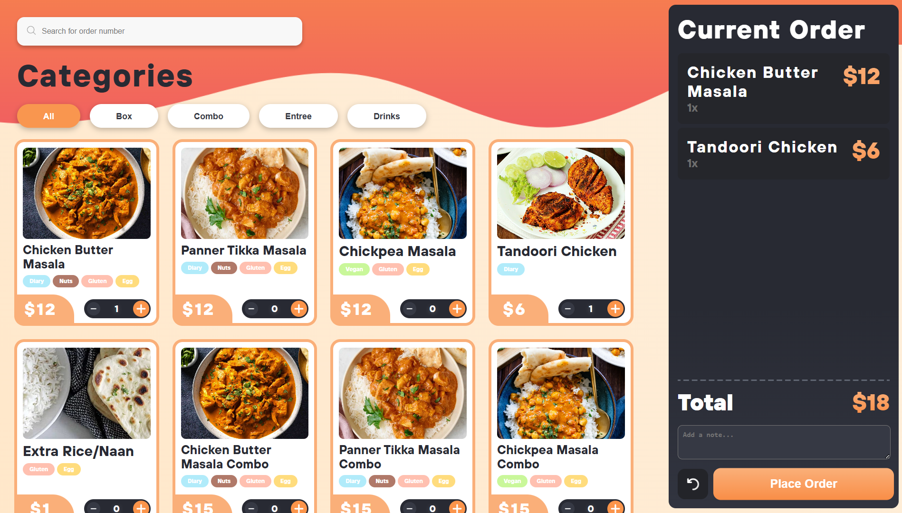

<p align="center">
  
</p>

<h1 align="center">
  Restaurant Ordering System
  <br>
</h1>

<h4 align="center">A comprehensive digital platform that streamlines restaurant ordering, optimizes kitchen operations, and provides insightful business analytics.</h4>
<p align="center">
  <a href="https://reactjs.org/" target="_blank" rel="noopener noreferrer">
    
  </a>
  <a href="https://nodejs.org/" target="_blank" rel="noopener noreferrer">
    
  </a>
  <a href="https://expressjs.com/" target="_blank" rel="noopener noreferrer">
    
  </a>
  <a href="https://www.mysql.com/" target="_blank" rel="noopener noreferrer">
    
  </a>
  <a href="https://vitejs.dev/" target="_blank" rel="noopener noreferrer">
    
  </a>
  <a href="https://sass-lang.com/" target="_blank" rel="noopener noreferrer">
    
  </a>
  <a href="https://tailwindcss.com/" target="_blank" rel="noopener noreferrer">
    
  </a>
</p>


## What is Restaurant Ordering System?

Restaurant Ordering System is a comprehensive digital platform built to streamline and optimize restaurant operations through three key interfaces: a Kitchen Display System (KDS) for kitchen staff, an Order Kiosk for customers, and an Analytics Dashboard for management.

By integrating real-time order tracking, efficient kitchen workflow management, and insightful business intelligence, the system reduces errors, accelerates service, and empowers data-driven decision-making, creating a seamless and efficient restaurant ecosystem.

## Demo

Try out the system live using mock data at these links:  
- **Ordering Kiosk:** [kiosk-ros.shreyansh-dev.app](https://kiosk-ros.shreyansh-dev.app)  
- **Kitchen Display System:** [kitchen-ros.shreyansh-dev.app](https://kitchen-ros.shreyansh-dev.app)  
- **Dashboard:** [dashboard-ros.shreyansh-dev.app](https://dashboard-ros.shreyansh-dev.app)

## Features

### Kitchen Operations

- **Real-time Order Queue**: Live order tracking with status updates
- **Kitchen Workflow Management**: Streamlined order processing and completion
- **Audio/Visual Alerts**: Notifications for new, delayed, and completed orders
- **Multi-device Support**: Optimized for kitchen tablets and displays

### Customer Experience

- **Self-Service Ordering**: Intuitive touch-screen interface for customers
- **Menu Management**: Dynamic menu with categories and customization options
- **Order Tracking**: Real-time order status updates

### Business Intelligence

- **Sales Analytics**: Comprehensive reporting and insights
- **Performance Metrics**: Track key business indicators
- **Data Visualization**: Charts and graphs for better decision making

## Architecture

The project follows a architecture with four main components:

- **Kitchen-Display-System**: React app for kitchen staff (KDS)
- **Order-Kiosk**: React app for customer self-ordering
- **Dashboard**: React app for analytics and management
- **Server**: Node.js/Express backend with MySQL database

## Quick Start

### Prerequisites

- Node.js (v18+ recommended)
- MySQL server
- Git

### Environment Setup

1. **Clone the repository**

   ```bash
   git clone <repository-url>
   cd Restaurant-Ordering-System
   ```

2. **Set up environment variables**

   Create `.env` files in each subproject:

   **Server/.env**
   ```env
   RDB_HOST=localhost
   RDB_PORT=3306
   RDB_USER=your_mysql_user
   RDB_PASSWORD=your_mysql_password
   RDB_DATABASE=your_database_name
   ```

   **Kitchen-Display-System/.env**
   ```env
   VITE_API_URL=http://localhost:5000
   VITE_WSS_URL=ws://localhost:5000
   ```

   **Order-Kiosk/.env**
   ```env
   VITE_API_URL=http://localhost:5000
   ```

   **Dashboard/.env**
   ```env
   VITE_API_URL=http://localhost:5000
   ```

3. **Install dependencies**

   ```bash
   # Backend dependencies
   cd Server
   npm install

   # Frontend dependencies
   cd ../Kitchen-Display-System
   npm install
   cd ../Order-Kiosk
   npm install
   cd ../Dashboard
   npm install
   ```

4. **Start the backend**

   ```bash
   cd Server
   npm start
   ```

5. **Start the frontends** (in separate terminals)

   ```bash
   # Kitchen Display
   cd Kitchen-Display-System
   npm run dev

   # Order Kiosk
   cd ../Order-Kiosk
   npm run dev

   # Dashboard
   cd ../Dashboard
   npm run dev
   ```

## Project Structure

```
Restaurant-Ordering-System/
├── Kitchen-Display-System/   # Kitchen display React app (KDS)
│   ├── src/
│   │   ├── components/       # React components
│   │   ├── contexts/         # React contexts
│   │   ├── hooks/            # Custom hooks
│   │   └── styles/           # SCSS stylesheets
│   ├── public/
│   │   └── Icon/             # Application icons
│   └── package.json
├── Order-Kiosk/             # Customer self-ordering React app
│   ├── src/
│   │   ├── components/       # Order interface components
│   │   ├── contexts/         # Order state management
│   │   └── styles/           # Order interface styles
│   └── package.json
├── Dashboard/               # Analytics and management React app
│   ├── src/
│   │   ├── components/       # Dashboard components
│   │   ├── charts/           # Data visualization
│   │   └── styles/           # Dashboard styles
│   └── package.json
├── Server/                  # Node.js/Express backend
│   ├── App.js               # Main application file
│   ├── Database.js          # Database connection
│   ├── routes/              # API endpoints
│   └── package.json
└── Design/                  # Design assets and mockups
```

## Technologies Used

### Frontend

- **React** - UI framework for all three applications
- **Vite** - Build tool and development server
- **SCSS** - Advanced CSS preprocessing (Kitchen Display & Order Kiosk)
- **Tailwind CSS** - Utility-first CSS framework (Dashboard)
- **Framer Motion** - Animation library for smooth transitions
- **React Context** - State management across components

### Backend

- **Node.js** - JavaScript runtime environment
- **Express** - Web application framework
- **MySQL** - Relational database management system
- **RESTful API** - Standard API design patterns

### Development Tools

- **ESLint** - Code quality and consistency
- **Git** - Version control system
- **npm** - Package management
